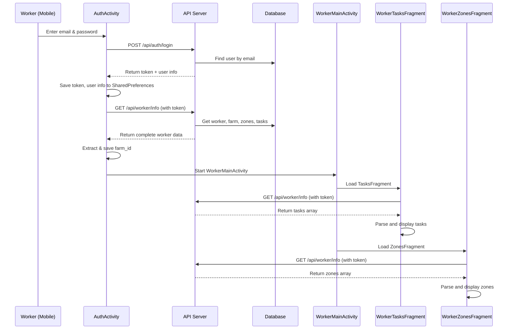

# Worker Mobile Flow Documentation

## Overview
This document describes the complete worker mobile experience in the IrrigAI app. Workers can only access the system via mobile app (not web). They see zones and tasks assigned to their farm.

## Authentication Flow

### 1. Worker Login
**Endpoint:** `POST /api/auth/login`

**Request:**
```json
{
  "email": "worker@example.com",
  "password": "azerty"
}
```

**Response:**
```json
{
  "success": true,
  "token": "eyJhbGciOiJIUzI1NiIsInR5cCI6IkpXVCJ9...",
  "user": {
    "id": "user_id_123",
    "email": "worker@example.com",
    "name": "Worker Name",
    "role": "WORKER"
  }
}
```

### 2. Auto Farm Retrieval (AuthActivity)
After login, `AuthActivity.java` automatically:
1. Saves token to SharedPreferences: `storageHelper.saveToken(token)`
2. Saves user info: `storageHelper.saveUserId()`, `saveUserEmail()`, `saveUserName()`
3. Calls `fetchWorkerInfoAndRedirect()` which:
   - Calls `GET /api/worker/info` with Authorization header
   - Extracts `farm.id` and `farm.name` from response
   - Saves to SharedPreferences: `storageHelper.saveFarmId()`, `saveFarmName()`
   - Redirects to `WorkerMainActivity`

### 3. Worker Info API
**Endpoint:** `GET /api/worker/info`

**Headers:**
```
Authorization: Bearer <token>
```

**Response:**
```json
{
  "success": true,
  "worker": {
    "id": "worker_id_123",
    "user_id": "user_id_123",
    "full_name": "John Doe",
    "email": "worker@example.com",
    "status": "active"
  },
  "farm": {
    "id": "farm_id_123",
    "name": "Farm Alpha",
    "location": "Region A"
  },
  "zones": [
    {
      "id": "zone_id_1",
      "name": "Zone A",
      "area": 1000,
      "description": "North section"
    },
    {
      "id": "zone_id_2",
      "name": "Zone B",
      "area": 1500,
      "description": "South section"
    }
  ],
  "tasks": [
    {
      "id": "task_id_1",
      "title": "Water Zone A",
      "description": "Irrigation task",
      "status": "TODO",
      "priority": "HIGH",
      "due_date": "2024-01-20T10:00:00Z",
      "created_at": "2024-01-15T10:00:00Z"
    },
    {
      "id": "task_id_2",
      "title": "Check soil moisture",
      "description": "Check soil in Zone B",
      "status": "IN_PROGRESS",
      "priority": "MEDIUM",
      "due_date": "2024-01-21T14:00:00Z",
      "created_at": "2024-01-15T10:00:00Z"
    }
  ]
}
```

## Worker Dashboard (WorkerMainActivity)

After authentication, workers see a bottom navigation with 4 tabs:

### 1. Tasks Tab (WorkerTasksFragment)
**Purpose:** Display all tasks assigned to the worker by the farm owner

**UI Components:**
- RecyclerView with WorkerTaskAdapter
- SwipeRefreshLayout for pull-to-refresh
- Task items show:
  - Title
  - Description
  - Priority (HIGH, MEDIUM, LOW) - with color coding
  - Status (TODO, IN_PROGRESS, DONE)
  - Due date

**Data Source:** `GetWorkerInfo()` response → `tasks` array

**Functionality:**
- Tap task to view details
- Swipe to refresh task list
- Status badge color:
  - TODO: Red
  - IN_PROGRESS: Yellow
  - DONE: Green

### 2. Zones Tab (WorkerZonesFragment)
**Purpose:** Display all zones in the worker's assigned farm

**UI Components:**
- RecyclerView with WorkerZoneAdapter
- SwipeRefreshLayout for pull-to-refresh
- Zone items show:
  - Zone name
  - Area (in m² or hectares)
  - Description/Crop type
  - Position coordinates (if applicable)

**Data Source:** `GetWorkerInfo()` response → `zones` array

**Functionality:**
- Tap zone to view details/map
- Swipe to refresh zone list
- Optional: Show zone on map (geo coordinates)

### 3. Robots Tab (WorkerRobotsFragment)
**Purpose:** Display irrigation robots assigned to farm

**Status:** Placeholder implementation

### 4. Profile Tab (WorkerProfileFragment)
**Purpose:** Display worker's profile and farm information

**UI Shows:**
- Worker name
- Email
- Farm name
- Farm location
- Logout button

## Data Flow Diagram



## Key Features

### 1. No Invitation System
- Workers no longer need invitation codes
- Direct access after login with auto-farm assignment
- Removed JoinFarmActivity

### 2. Token-Based Authentication
- Mobile token stored in SharedPreferences
- Sent in Authorization header for API calls
- Token provides access to worker's farm data only

### 3. Real-Time Data
- Pull-to-refresh on both Zones and Tasks tabs
- Data fetched from `/api/worker/info` on refresh

### 4. Responsive UI
- Loading indicators during data fetch
- Error toast messages
- Empty state handling

## Adapters

### WorkerTaskAdapter
- Maps `Task` objects to RecyclerView items
- Shows: title, description, priority, status
- Supports `updateTasks()` method for refresh

### WorkerZoneAdapter
- Maps `Zone` objects to RecyclerView items
- Shows: name, area, description, mode
- Supports `updateZones()` method for refresh

## Error Handling

### Authentication Errors
- **401 Unauthorized:** Invalid credentials
- **403 Forbidden:** Owner trying to login (blocked)
- **404 Not Found:** User doesn't exist

### API Errors
- **Network Error:** Show network error toast
- **Parse Error:** Show parsing error toast
- **500 Server Error:** Show server error toast

## Testing Checklist

- [ ] Worker can login with email and default password "azerty"
- [ ] Farm ID is automatically saved after login
- [ ] WorkerMainActivity displays all 4 tabs
- [ ] Tasks tab loads and displays tasks
- [ ] Zones tab loads and displays zones
- [ ] Pull-to-refresh works on both tabs
- [ ] Error messages display properly
- [ ] Owner cannot login via mobile (403)
- [ ] Profile tab shows correct farm information
- [ ] Logout clears SharedPreferences

## Database Models

### Worker Model
```javascript
{
  user_id: ObjectId,
  farm_id: ObjectId,
  full_name: String,
  status: String,
  created_at: Date
}
```

### Zone Model
```javascript
{
  farm_id: ObjectId,
  name: String,
  crop_type: String,
  width: Number,
  length: Number,
  x: Number,
  y: Number,
  mode: String,
  moisture_threshold: Number,
  created_at: Date
}
```

### Task Model
```javascript
{
  farm_id: ObjectId,
  worker_id: ObjectId,
  title: String,
  description: String,
  priority: String,
  status: String,
  due_date: Date,
  created_at: Date
}
```

## Mobile Storage (SharedPreferences)

The following data is persisted:
- `token` - JWT token for API authentication
- `user_id` - Worker's user ID
- `user_email` - Worker's email
- `user_name` - Worker's name
- `farm_id` - Assigned farm ID
- `farm_name` - Assigned farm name
- `user_type` - Always "worker"
- `user_role` - "WORKER"

## API Endpoints Summary

| Endpoint | Method | Auth | Purpose |
|----------|---------|------|---------|
| `/api/auth/login` | POST | No | Worker login |
| `/api/auth/signup` | POST | No | Worker signup |
| `/api/worker/info` | GET | Yes | Get worker info, farm, zones, tasks |

## Future Enhancements

1. **Task Management**
   - Mark tasks as complete
   - Add comments to tasks
   - Upload photo evidence

2. **Zone Management**
   - View zone on map
   - See sensor data
   - View irrigation history

3. **Robots**
   - Control robots
   - View robot status
   - Schedule robot operations

4. **Analytics**
   - Daily activity summary
   - Completed tasks history
   - Performance metrics
